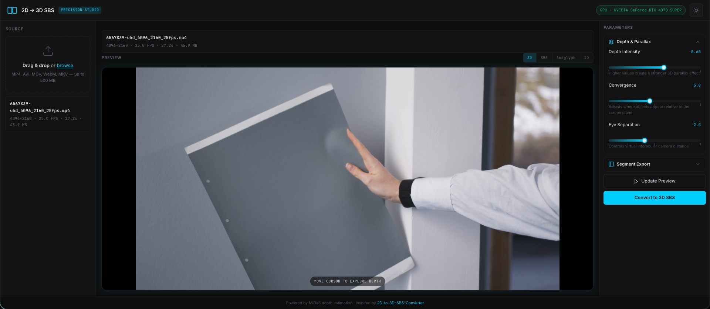

# 2D to 3D SBS Converter

Web application that converts standard 2D videos into stereoscopic 3D Side-by-Side (SBS) format for VR viewing, using [MiDaS](https://github.com/isl-org/MiDaS) depth estimation.

Inspired by [PointerSoftware/2D-to-3D-SBS-Converter](https://github.com/PointerSoftware/2D-to-3D-SBS-Converter).



## Features

- Upload local videos (MP4, AVI, MOV, WebM, MKV — up to 500 MB)
- Adjustable 3D parameters: depth intensity, convergence, eye separation
- Live preview before full conversion
- Optional segment processing for long videos
- GPU-accelerated depth estimation (CUDA) with CPU fallback
- Audio preservation in the output
- Modern web UI with progress tracking

## Requirements

- Python 3.10+
- FFmpeg (`ffprobe` included)
- NVIDIA GPU with CUDA (recommended)

## Installation

```bash
git clone https://github.com/soifaxa/3D-converter.git
cd 3D-converter
python3 -m venv .venv
source .venv/bin/activate
pip install -r requirements.txt
```

On first launch, the MiDaS DPT_Large model is downloaded automatically (~1.3 GB).

## Run

```bash
source .venv/bin/activate
uvicorn app.main:app --host 0.0.0.0 --port 8000
```

Or without activating the virtual environment:

```bash
.venv/bin/uvicorn app.main:app --host 0.0.0.0 --port 8000
```

Open http://localhost:8000 in your browser.

## Run as a systemd service (Linux)

To keep the application running in the background and start it automatically on boot, create a systemd unit file.

1. Clone the repository and complete the [installation](#installation) steps above.

2. Create `/etc/systemd/system/3d-converter.service` (replace `APP_DIR` and `APP_USER` with your install path and the user that should run the service):

```ini
[Unit]
Description=2D to 3D SBS Converter
After=network-online.target
Wants=network-online.target

[Service]
Type=simple
User=APP_USER
Group=APP_USER
WorkingDirectory=APP_DIR
ExecStart=APP_DIR/.venv/bin/uvicorn app.main:app --host 0.0.0.0 --port 8000
Restart=on-failure
RestartSec=10
StandardOutput=journal
StandardError=journal

Environment=PYTHONUNBUFFERED=1
Environment=HF_HUB_DISABLE_TELEMETRY=1
Environment=DO_NOT_TRACK=1

[Install]
WantedBy=multi-user.target
```

Example with `/opt/3d-converter` and user `converter`:

```ini
User=converter
Group=converter
WorkingDirectory=/opt/3d-converter
ExecStart=/opt/3d-converter/.venv/bin/uvicorn app.main:app --host 0.0.0.0 --port 8000
```

3. Enable and start the service:

```bash
sudo systemctl daemon-reload
sudo systemctl enable 3d-converter.service
sudo systemctl start 3d-converter.service
```

4. Useful commands:

```bash
sudo systemctl status 3d-converter    # check status
sudo systemctl restart 3d-converter   # restart after an update
sudo systemctl stop 3d-converter      # stop the service
journalctl -u 3d-converter -f           # follow logs
```

**Notes:**

- The service user must have read/write access to the application directory (uploads, outputs, and model cache).
- For GPU acceleration, the service user needs access to NVIDIA devices (`/dev/nvidia*`).
- The first start may take several minutes while the MiDaS model is downloaded.
- To use a different port, change `--port` in `ExecStart` and update your firewall or reverse proxy accordingly.

## How It Works

1. **Frame extraction** — reads frames from the source video
2. **Depth estimation** — MiDaS DPT_Large generates a depth map per frame
3. **Stereoscopic synthesis** — left/right eye views via depth-based pixel displacement
4. **SBS assembly** — combines views into 1920×1080 Side-by-Side format
5. **Encoding** — H.264 MP4 with original audio (NVENC if available)

## API Endpoints

| Method | Endpoint | Description |
|--------|----------|-------------|
| GET | `/api/health` | Server and GPU status |
| POST | `/api/upload` | Upload a video file |
| POST | `/api/preview` | Generate preview image |
| POST | `/api/convert` | Start conversion job |
| GET | `/api/jobs/{id}` | Job status and progress |
| GET | `/api/jobs/{id}/download` | Download converted video |

## License

MIT
